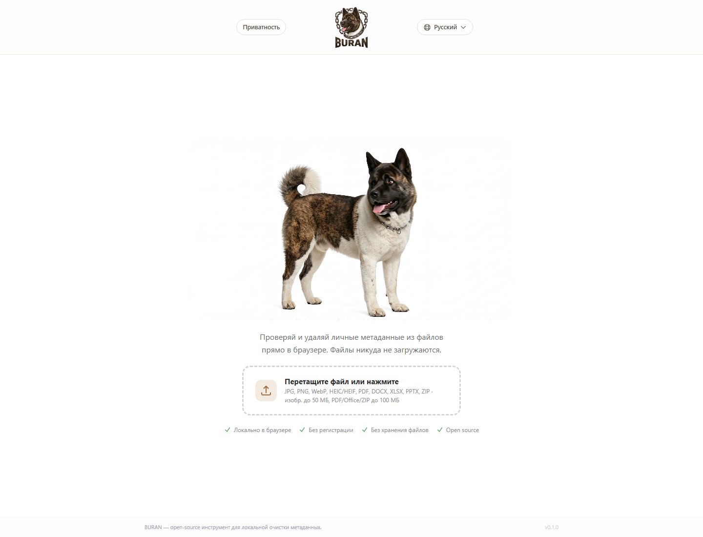

# BURAN

Browser-only metadata sanitiser for privacy-sensitive files.

[Live site](https://buran.pet) | [GitHub](https://github.com/Andriikozhushko/buran) | [Security model](docs/SECURITY_MODEL.md) | [No-network guarantee](docs/NO_NETWORK_GUARANTEE.md)



## What it is

BURAN is a static web application that inspects files for personal metadata, removes supported metadata locally in the browser, and verifies the cleaned output before offering it for download.

The project is designed around one strict product promise:

> Your file stays on your device. No uploads, no backend, no analytics, no accounts.

This makes BURAN a good portfolio piece for:

- privacy-first product design
- binary file parsing in the browser
- defensive format handling
- trustworthy UX for high-risk user actions
- verifiable client-side guarantees

## Why it exists

Many "metadata cleaner" tools either upload files to a server, make vague privacy claims, or silently fail on unsupported formats. BURAN takes the opposite approach:

- local-first processing only
- honest blocked states instead of unsafe fallbacks
- post-clean verification before success is shown
- explicit limits documented in product copy and tests

## Core capabilities

- JPEG, PNG, WebP metadata cleaning
- HEIC/HEIF clean export flow
- PDF metadata-only sanitisation
- DOCX, XLSX, PPTX metadata-only sanitisation
- ZIP archive metadata cleaning with recursive supported-file handling
- independent verification pass after cleanup
- printable/downloadable cleanup certificate
- multilingual UI

See [docs/FORMAT_SUPPORT_MATRIX.md](docs/FORMAT_SUPPORT_MATRIX.md) for the exact scan / clean / verify matrix.

## Privacy and trust model

- Files are processed locally in Web Workers.
- The application has no backend and no runtime API calls.
- Static and runtime tests guard against network usage.
- BURAN does not claim "perfect anonymity" or removal of visible content.
- Unsupported or risky documents are blocked instead of being modified unsafely.

Relevant docs:

- [Security model](docs/SECURITY_MODEL.md)
- [Privacy and guarantees](docs/PRIVACY_AND_GUARANTEES.md)
- [No-network guarantee](docs/NO_NETWORK_GUARANTEE.md)
- [Architecture](docs/ARCHITECTURE.md)

## Stack

- React 19
- TypeScript 6
- Vite 8
- Tailwind CSS 4
- Vitest 4
- Playwright
- Web Workers
- Web Crypto API
- `pdf-lib`, `JSZip`, `libheif-js`

## Local development

Prerequisites:

- Node.js 22+
- npm

Install and run:

```bash
npm install
npm run dev
```

Quality checks:

```bash
npm run typecheck
npm run lint
npm test
npm run test:e2e
npm run build
```

## Project structure

```text
src/
  components/   UI and product states
  i18n/         localised copy
  lib/          format detection, scan, clean, verify logic
  workers/      scan and clean workers
tests/
  unit/         format and privacy guards
  integration/  end-to-end processing flows
  e2e/          browser smoke tests and no-network assertions
docs/
  product, security, format, QA, and validation notes
```

## Engineering highlights

- Static-site deployment with no server-side processing
- Defensive handling of malformed, encrypted, signed, or unsupported files
- Verified-clean flow instead of "best effort" success states
- ZIP recursion with conservative safety constraints
- JPEG orientation handling with explicit disclosure when re-encoding is required
- Resume-quality documentation for privacy, QA, architecture, and support scope

## Supported formats

| Format | Support level |
| --- | --- |
| JPEG | Supported |
| PNG | Supported |
| WebP | Supported |
| HEIC / HEIF | Supported via clean export |
| PDF | Supported, metadata-only |
| DOCX / XLSX / PPTX | Supported, metadata-only |
| ZIP | Supported with recursive cleaning of supported nested files |

Roadmap formats are tracked in [docs/FORMAT_ROADMAP.md](docs/FORMAT_ROADMAP.md).

## What BURAN does not do

- remove visible content
- remove watermarks or steganography
- guarantee anonymity
- rewrite unsupported formats
- send files to a remote cleaning service

## Open source

Issues, bug reports, format-support requests, and careful privacy-focused contributions are welcome.

- [Contributing guide](CONTRIBUTING.md)
- [Security policy](SECURITY.md)
- [Issue templates](.github/ISSUE_TEMPLATE)

## License

MIT - see [LICENSE](LICENSE).
